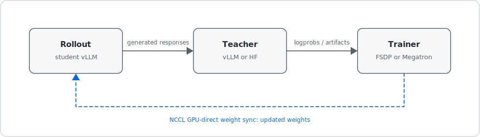

# AsyncOPD

AsyncOPD is a multi-process training pipeline for language-model distillation, reward-based reinforcement learning, and supervised fine-tuning. It supports on-policy distillation (OPD), GRPO/DAPO-style training, and SFT with vLLM generation, FSDP/Megatron training, and NCCL GPU-direct weight synchronization.

For full documentation, see the [documentation index](docs/index.md).

## Why AsyncOPD?

AsyncOPD is built around a simple loop: the student model generates its own answers, a stronger teacher/reference model scores them, and the student is updated from that feedback.

- **OPD targets the real student distribution.** Because training uses responses from the current student, the teacher helps correct the behavior the student actually produces instead of only imitating offline examples.
- **Async execution keeps expensive GPUs busy.** Rollout, teacher scoring, training, and weight sync can overlap instead of waiting for one stage to finish before the next starts.
- **Staleness is explicit and configurable.** Run synchronously for debugging, use bounded n-step-off scheduling for safer overlap, or switch to fully async scheduling for throughput experiments.
- **The implementation is built for large model jobs.** AsyncOPD combines vLLM rollout/teacher workers, FSDP or Megatron training, and NCCL GPU-direct weight transfer.
- **Other training modes are available when needed.** GRPO/DAPO-style reward training and SFT share the same infrastructure, but OPD is the main design center.
- **Public examples are ready to adapt.** Curated OPD, GRPO, and SFT configs live under `configs/examples/`.

## Training modes at a glance

| Mode | What happens | Start from |
| --- | --- | --- |
| OPD | Student rollout -> teacher scoring -> KL-style student update | <code>configs/examples/</code><br><code>opd_gsm8k_0.5b_4gpu.yaml</code> |
| GRPO | Grouped student rollouts -> reward scoring -> PPO-style update | <code>configs/examples/</code><br><code>grpo_gsm8k_0.5b_4gpu.yaml</code> |
| SFT | Prompt/completion supervised updates only | <code>configs/examples/</code><br><code>sft_qwen3_1.7b.yaml</code> |

## Architecture overview

A typical OPD/GRPO run is coordinated by one CPU process and multiple GPU worker roles:



Arrows show logical data dependencies; the CPU coordinator handles scheduling,
queues, batching, retries, and mode-specific routing.

See [Architecture guide](docs/architecture.md) for process lifecycle, queues, scheduling, and trust boundaries.

## Quick start

### 1. Install

```bash
conda create -n opd python=3.12
conda activate opd
```

If conda is not available, use a standard Python 3.12 virtual environment:

```bash
python -m venv .venv
source .venv/bin/activate
python -m pip install -U pip wheel setuptools
```

Then install the pinned runtime:

```bash
# Default CUDA 12.8 PyTorch build used by the pinned dependency set.
python -m pip install torch==2.9.1 --index-url https://download.pytorch.org/whl/cu128

python -m pip install -r requirements.txt
python -m pip install -e . --no-deps
```

### 2. Run no-GPU checks

```bash
opd-train --help
opd-eval --help

python -m pytest tests/test_cli_entrypoints.py tests/test_data_format.py tests/test_kl_loss.py \
  tests/test_packing.py tests/test_sft_loss.py tests/test_tokenizer_padding.py \
  -q -o addopts="" -m "not slow"
```

These checks validate the CLI and core CPU-safe utilities. The `-m "not slow"`
filter avoids tokenizer tests that may download Hugging Face model artifacts.

For a broader control-plane smoke test that still does not require GPUs:

```bash
python -m pytest tests/test_cpu_stub_pipeline.py -q -o addopts=""
```

### 3. Run a first GPU smoke test

Real training requires GPUs. For a quick OPD smoke test, start with the 4-GPU Qwen2.5 GSM8K config and override it to one training step:

```bash
python -m opd.cli.train \
  --config configs/examples/opd_gsm8k_0.5b_4gpu.yaml \
  --overwrite \
  --set trainer.total_steps=1 trainer.total_epochs=1 eval.freq=-1 eval.before_train=false trainer.save_freq=-1
```

Expected output directory:

```text
results/examples/opd_gsm8k_0.5b_4gpu/
  log.jsonl
  run.log
  trace.json
```

For step-by-step setup, hardware expectations, and a first evaluation command, see [Quickstart](docs/quickstart.md).

## Public example matrix

| Example config | Mode | Hardware | Model/data | Best for |
| --- | --- | --- | --- | --- |
| <code>configs/examples/</code><br><code>opd_gsm8k_0.5b_4gpu.yaml</code> | OPD | 4 GPUs | Qwen2.5-0.5B student, Qwen2.5-1.5B teacher, GSM8K | Small OPD smoke test |
| <code>configs/examples/</code><br><code>opd_qwen3_1.7b.yaml</code> | OPD | 8 GPUs | Qwen3 1.7B student, Qwen3 30B teacher, DeepScaleR/AIME | Standard OPD starter |
| <code>configs/examples/</code><br><code>grpo_qwen3_1.7b.yaml</code> | GRPO | 8 GPUs | Qwen3 1.7B, DeepScaleR/AIME | 8-GPU GRPO starter |
| <code>configs/examples/</code><br><code>grpo_gsm8k_0.5b_8gpu.yaml</code> | GRPO | 8 GPUs | Qwen2.5-0.5B, GSM8K | Larger GSM8K rollout/trainer layout |
| <code>configs/examples/</code><br><code>grpo_gsm8k_0.5b_4gpu.yaml</code> | GRPO | 4 GPUs | Qwen2.5-0.5B, GSM8K | Smallest GRPO starter |
| <code>configs/examples/</code><br><code>dapo_deepmath_qwen3_4b_8gpu.yaml</code> | DAPO | 8 GPUs | Qwen3 4B, DeepMath/AIME | DAPO-style settings without reference KL |
| <code>configs/examples/</code><br><code>opd_deepmath_qwen3_1.7b_</code><br><code>pg_mc64_stepoff_8gpu.yaml</code> | OPD | 8 GPUs | Qwen3 1.7B student, Qwen3 30B teacher, DeepMath/AIME | Multi-sample PG-KL with bounded step-off scheduling |
| <code>configs/examples/</code><br><code>opd_deepmath_qwen3_1.7b_</code><br><code>pg_mc64_async_8gpu.yaml</code> | OPD | 8 GPUs | Qwen3 1.7B student, Qwen3 30B teacher, DeepMath/AIME | Multi-sample PG-KL with fully async scheduling |
| <code>configs/examples/</code><br><code>sft_qwen3_1.7b.yaml</code> | SFT | 2+ GPUs | Qwen3 1.7B, local prompt/completion parquet | Supervised fine-tuning template |

Advanced/research examples are also available under `configs/examples/advanced/`.
Use these after you have run the corresponding starter config successfully.

| Advanced config | Focus | Hardware |
| --- | --- | --- |
| <code>configs/examples/advanced/</code><br><code>opd_deepmath_qwen3_4b_</code><br><code>areal_decoupled_8gpu.yaml</code> | AReaL-style decoupled policy-gradient KL | 8 GPUs |
| <code>configs/examples/advanced/</code><br><code>opd_deepmath_qwen3_4b_</code><br><code>m2po_8gpu.yaml</code> | Policy-gradient KL with M2PO dynamic clipping | 8 GPUs |
| <code>configs/examples/advanced/</code><br><code>opd_deepmath_qwen3_4b_</code><br><code>reverse_kl_topk_8gpu.yaml</code> | Sparse/top-k reverse KL using rollout student support | 8 GPUs |
| <code>configs/examples/advanced/</code><br><code>opd_deepmath_qwen3_4b_</code><br><code>multisample_forward_kl_8gpu.yaml</code> | Multi-sample forward KL | 8 GPUs |
| <code>configs/examples/advanced/</code><br><code>opd_deepmath_qwen3_4b_</code><br><code>thunlp_default_8gpu.yaml</code> | THUNLP-style top-k PPO OPD loss, effectively sparse top-k reverse KL | 8 GPUs |
| <code>configs/examples/advanced/</code><br><code>opd_deepmath_qwen3_4b_</code><br><code>dense_forward_kl_streaming_8gpu.yaml</code> | Dense forward KL with hidden recompute and streaming step-off | 8 GPUs |
| <code>configs/examples/advanced/</code><br><code>opd_deepmath_qwen3_4b_</code><br><code>dense_reverse_kl_streaming_8gpu.yaml</code> | Dense reverse KL with hidden recompute and streaming step-off | 8 GPUs |
| <code>configs/examples/advanced/</code><br><code>opd_code_qwen3_1.7b_</code><br><code>pg_mc64_async_8gpu.yaml</code> | Code-training data plus HumanEval+/MBPP+/LCB post-eval config | 8 GPUs |
| <code>configs/examples/advanced/</code><br><code>opd_deepmath_qwen3_1.7b_</code><br><code>fused_hybrid_sync_8gpu.yaml</code> | Experimental fully synchronous scheduler that fuses rollout, scoring, and training synchronization | 8 GPUs |


Generated local datasets are not included in the repository. If you adapt a
config that expects `data/deepmath_difficulty6/train.parquet`, build it from
the public DeepMath source using the recipe in the
[Configuration guide](docs/configuration.md#building-datadeepmath_difficulty6trainparquet).

## Common commands

The commands below assume a source checkout. If you installed AsyncOPD from
a wheel, copy the config you want to use into your working directory and replace
`python -m opd.cli.train` / `python -m opd.cli.eval` with `opd-train` /
`opd-eval`.

OPD training:

```bash
python -m opd.cli.train --config configs/examples/opd_gsm8k_0.5b_4gpu.yaml --overwrite
```

8-GPU Qwen3 OPD training:

```bash
python -m opd.cli.train --config configs/examples/opd_qwen3_1.7b.yaml --overwrite
```

GRPO training:

```bash
python -m opd.cli.train --config configs/examples/grpo_gsm8k_0.5b_4gpu.yaml --overwrite
```

DAPO training after generating the DeepMath parquet:

```bash
python -m opd.cli.train --config configs/examples/dapo_deepmath_qwen3_4b_8gpu.yaml --overwrite
```

SFT training after replacing the template parquet paths:

```bash
python -m opd.cli.train --config configs/examples/sft_qwen3_1.7b.yaml --overwrite
```

Evaluation:

```bash
python -m opd.cli.eval --config configs/examples/opd_qwen3_1.7b.yaml --model student --gpus 0,1,2,3 --dp 4
python -m opd.cli.eval --config configs/examples/grpo_qwen3_1.7b.yaml --model student --gpus 0,1,2,3 --dp 4 \
  --datasets AIME25 AMC23 "HMMT Feb25" "HMMT Nov25" MATH-500
```

Supported short eval aliases include `AIME25`, `AMC`/`AMC23`, `HMMT Feb25`, `HMMT Nov25`, and `MATH-500`. See [Evaluation guide](docs/evaluation.md).

GPU integration tests:

```bash
python scripts/run_integration_tests.py --list
python scripts/run_integration_tests.py --filter <name>
```

## Configuration shape

Public YAML configs use the canonical top-level shape:

```yaml
model:
  path: Qwen/Qwen3-1.7B

teacher:
  path: Qwen/Qwen3-30B-A3B-Instruct-2507
  gpu_ids: '0'
  vllm:
    tensor_parallel_size: 1
    n_logprobs: 1

data:
  train_files: hf:agentica-org/DeepScaleR-Preview-Dataset
  val_files: hf:Maxwell-Jia/AIME_2024
  prompt_key: problem
  answer_key: answer
  max_prompt_length: 2048
  max_response_length: 16384

rollout:
  gpu_ids: 1,2,3
  n_gpus: 3
  temperature: 1.0
  vllm:
    max_model_len: 18432
    max_num_seqs: 512

trainer:
  gpu_ids: 4,5,6,7
  n_gpus: 4
  batch_size: 256
  micro_batch_size: 16
  total_steps: 200
  optim:
    lr: 5e-6
    lr_decay_style: constant

algorithm:
  mode: opd
  opd:
    kl_loss_mode: forward_kl

pipeline:
  n_step_off:
    step_off: 2

weight_sync:
  backend: nccl
```

Use the top-level sections shown above for new configs. See the
[Configuration guide](docs/configuration.md) for the full field reference.

## Scheduling modes

| Mode | Engine/config | Purpose |
| --- | --- | --- |
| Synchronous | hybrid engine | First-run validation with rollout, scoring, training, and weight sync in sequence. |
| N-step-off | `pipeline.n_step_off.step_off: N` | Overlap rollout/scoring/training with bounded staleness. |
| Fully async | `pipeline.scheduling_mode: fully_async` | AsyncOPD's async path for overlapping rollout, scoring, training, and weight sync. |

## Outputs

```text
results/<experiment>/<config>/
  log.jsonl            # training/eval metrics as JSON lines
  run.log              # stdout/stderr from the run
  trace.json           # Perfetto/Chrome trace
  checkpoints/         # checkpoint directories when enabled
  validation_outputs/  # evaluation sample outputs
```

## Documentation

- [Documentation index](docs/index.md)
- [Quickstart](docs/quickstart.md)
- [Architecture guide](docs/architecture.md)
- [Configuration guide](docs/configuration.md)
- [Training modes](docs/training-modes.md)
- [Loss/logit chunking](docs/loss-chunking.md)
- [Evaluation guide](docs/evaluation.md)
- [Troubleshooting guide](docs/troubleshooting.md)
- [Testing guide](TESTING.md)

## Acknowledgements

AsyncOPD builds on ideas and implementation patterns from the open-source
LLM training ecosystem, including veRL / HybridFlow, which is licensed under
Apache-2.0. See [NOTICE](NOTICE) for attribution details.

## License

Apache-2.0. See [LICENSE](LICENSE) and [NOTICE](NOTICE).

## Citation

```bibtex
@misc{kang2026asyncopdstaleonpolicydistillation,
  title={AsyncOPD: How Stale Can On-Policy Distillation Be?},
  author={Wonjun Kang and Kevin Galim and Seunghyuk Oh and Minjun Kang and Sanghyun Park and Donghoon Kim and Minjae Lee and Minseo Kim and Rishabh Tiwari and Yuchen Zeng and Hyung Il Koo and Kangwook Lee},
  year={2026},
  eprint={2606.24143},
  archivePrefix={arXiv},
  primaryClass={cs.LG},
  url={https://arxiv.org/abs/2606.24143},
}
```
